# tensorflow序列到序列

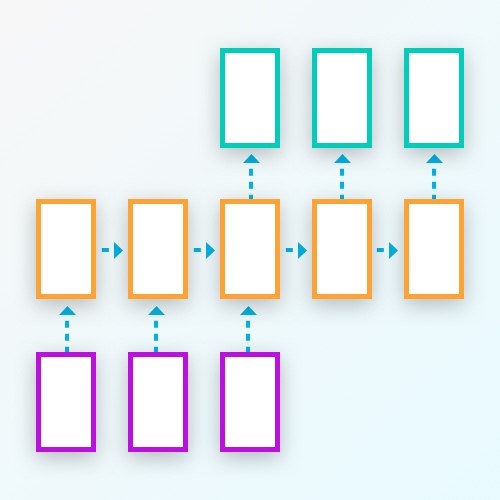

## 数据集

数据集存在于/ data /文件夹中。 目前，它由以下文件组成：
* ** letters_source.txt **：输入字母序列的列表。 每个序列都是自己的行。
* ** letters_target.txt **：我们将在培训过程中使用的目标序列列表。 这里的每个序列都是对具有相同行号的letters_source.txt中的输入序列的响应。
  
## 预处理
要做任何有用的事情，我们需要将每个字符串变成一个字符列表：

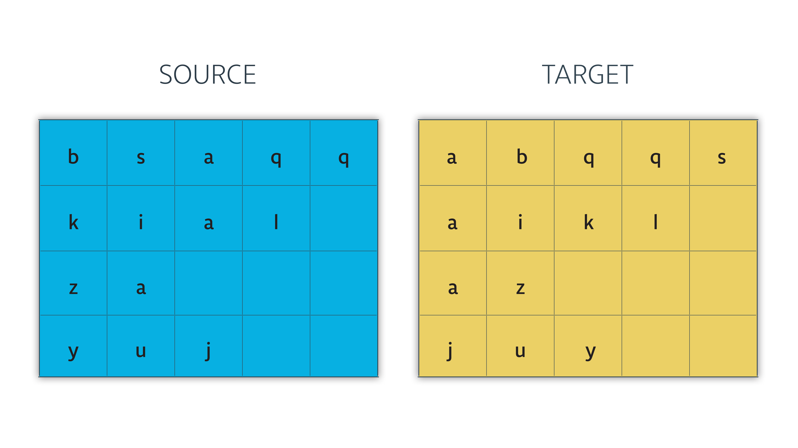

然后将字符转换为我们的词汇表中声明的int值：

### 序列到序列模型

我们现在可以开始定义构建seq2seq模型的函数。 我们正在从下到上构建以下组件：

     2.1编码器Encoder
         - 嵌入Embedding
         - 编码器单元Encoder cell
     2.2解码器Decoder
         1-过程解码器输入Process decoder inputs
         2-设置解码器Set up the decoder
             - 嵌入Embedding
             - 解码器单元Decoder cell
             密集输出层Dense output layer
             - 训练解码器Training decoder
             - 推理解码器Inference decoder
     2.3 Seq2seq型号连接编码器和解码器Seq2seq model connecting the encoder and decoder
     2.4建立与该模型挂钩的训练图Build the training graph hooking up the model with the 
        优化optimizer

### 2.1编码器

我们将构建的模型的第一位是编码器。 在这里，我们将嵌入输入数据，构建我们的编码器，然后将嵌入的数据传递给编码器。

- 使用[`tf.contrib.layers.embed_sequence`]嵌入输入数据（https://www.tensorflow.org/api_docs/python/tf/contrib/layers/embed_sequence ）
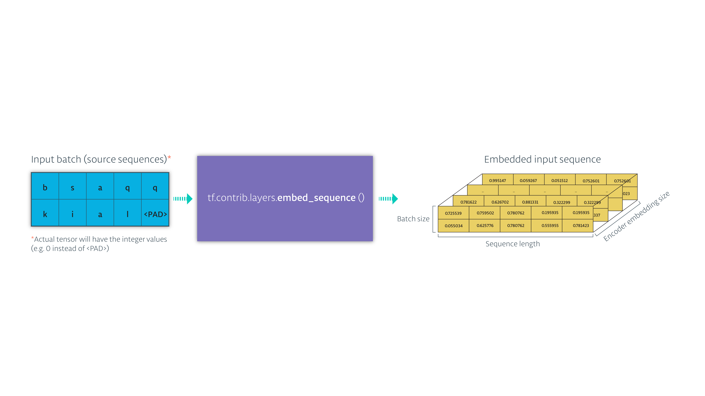

- 将嵌入式输入传递到一堆RNN。 保存RNN状态并忽略输出。
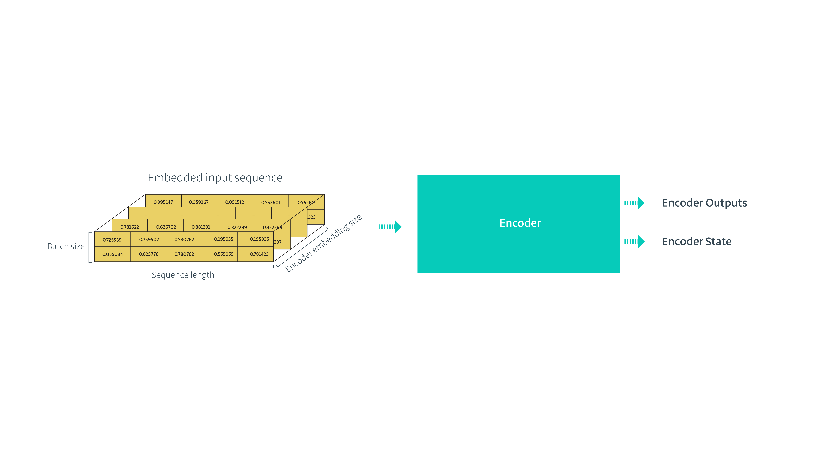

## 2.2解码器

解码器可能是这个模型中最受关注的部分。需要以下步骤来创建它：

    1-过程解码器输入
    2-设置解码器组件
         - 嵌入
         - 解码器单元
        密集输出层
         - 训练解码器
         - 推理解码器

### 过程解码器输入

在训练过程中，目标序列将用于两个不同的地方：

 用它们来计算损失
 2.在培训期间将它们送入解码器，使模型更加健壮。

现在我们需要解决第二点。我们假设我们的目标看起来像这样的信件/单词形式（我们这样做是为了可读性。在代码的这一点上，这些序列将是int形式）：

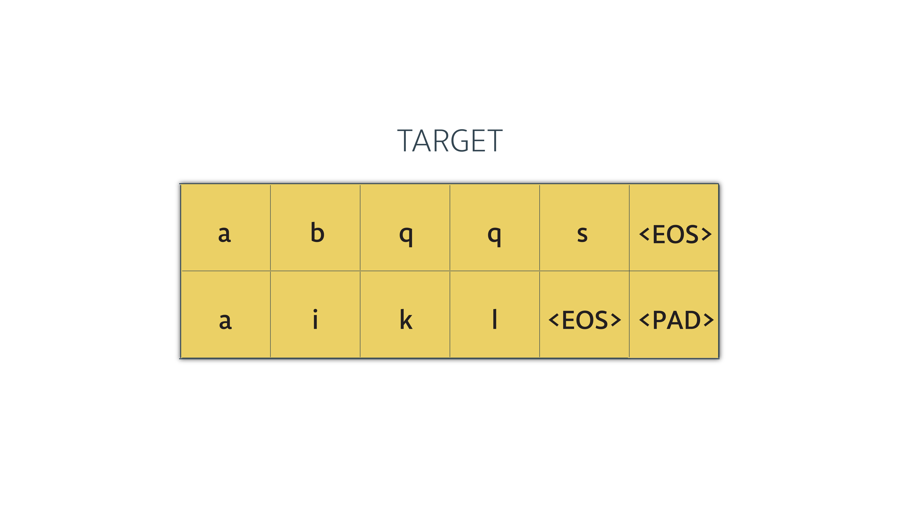

我们需要对张量进行简单的变换，然后再将其转换为解码器：

1-我们将在每个时间步骤将序列的项目提供给解码器。想想最后一个时间步 - 解码器输出其输出中的最后一个字。该步骤的输入是最后一个目标序列之前的项目。在这种情况下，解码器不能用于目标序列中的最后一个项目。所以我们需要删除最后一个项目。

我们使用tensorflow的tf.strided_slice（）方法。我们把它的张量，以及从哪里开始的指数，以及在哪里结束切割。

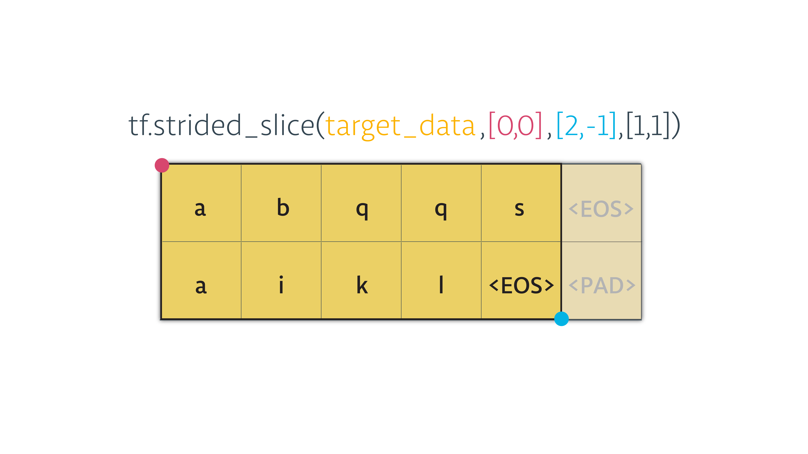

2-我们馈送到解码器的每个序列中的第一个项目必须是GO符号。所以我们来补充一点。

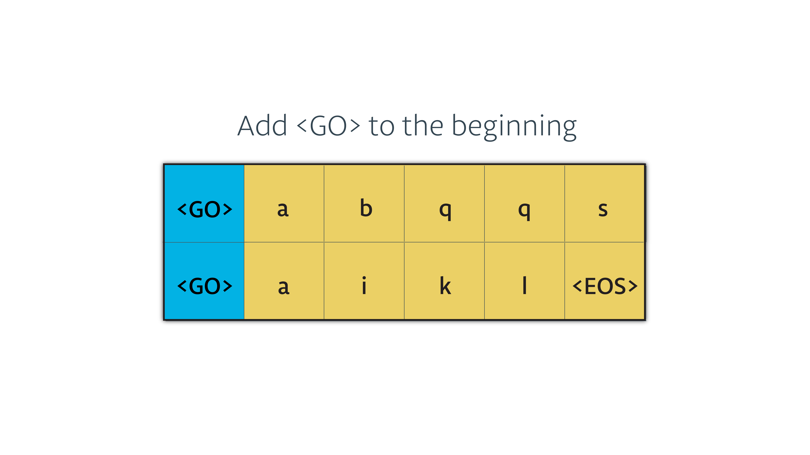

现在，张量已准备好送入解码器。看起来像这样（如果我们从ints转换成字母/符号）：

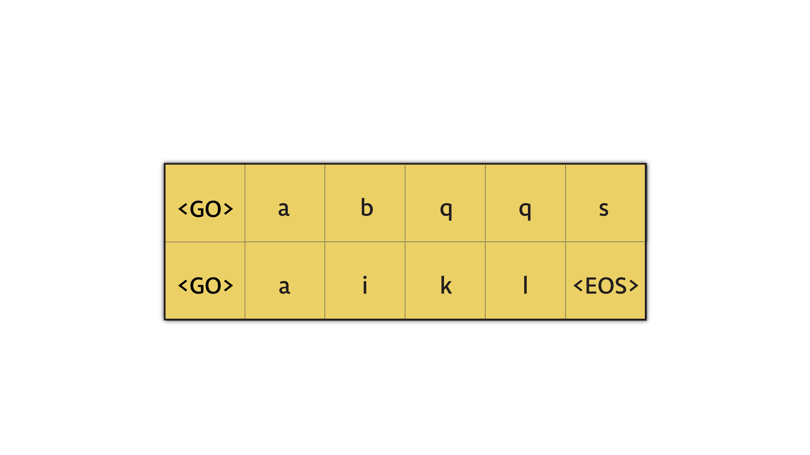

### 设置解码器组件

         - 嵌入
         - 解码器单元
        密集输出层
         - 训练解码器
         - 推理解码器

#### 1-嵌入
现在我们已经准备了训练解码器的输入，我们需要嵌入它们，以便它们可以准备好传递给解码器。

我们将创建一个嵌入式矩阵，如下所示，然后tf.nn.embedding_lookup将我们的输入转换为其嵌入的等价物：
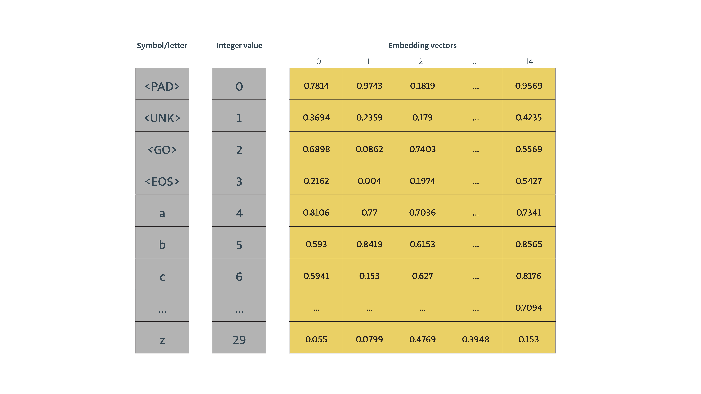

#### 2-解码器单元
然后我们声明我们的解码器单元。就像编码器一样，我们也在这里使用一个tf.contrib.rnn.LSTMCell。

我们需要声明用于训练过程的解码器，以及用于推理/预测过程的解码器。这两个解码器将共享其参数（使得在部署模型时可以使用在训练阶段设置的所有权重和偏差）。

首先，我们需要定义我们将用于解码器RNN的单元格类型。我们选择了LSTM。

#### 3-密集输出层
在我们宣布解码器之前，我们需要创建一个输出层，它将一个tensorflow.python.layers.core.Dense层，将解码器的输出转换为逻辑，告诉我们解码器词汇的哪个元素解码器选择在每个时间步长输出。

#### 4-培训解码器
基本上，我们将创建两个解码器，共享它们的参数。一个用于训练，一个用于推理。这两个类似于使用tf.contrib.seq2seq创建的类型。** BasicDecoder **和tf.contrib.seq2seq。** dynamic_decode **。然而，它们不同之处在于，我们将目标序列作为每个时间步长的训练解码器的输入，以使其更加健壮。

我们可以将训练解码器看作是这样的（除了可以批量使用序列）：
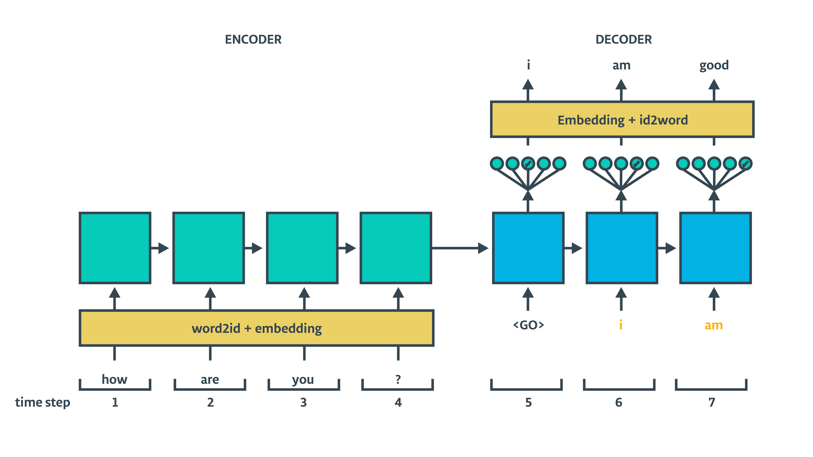

训练解码器**不会将每个时间步长的输出提供给下一个。相反，解码器时间步长的输入是来自训练数据集（橙色字母）的目标序列。

#### 5-推理解码器
推理解码器是我们在将我们的模型部署到野外时将使用的解码器。

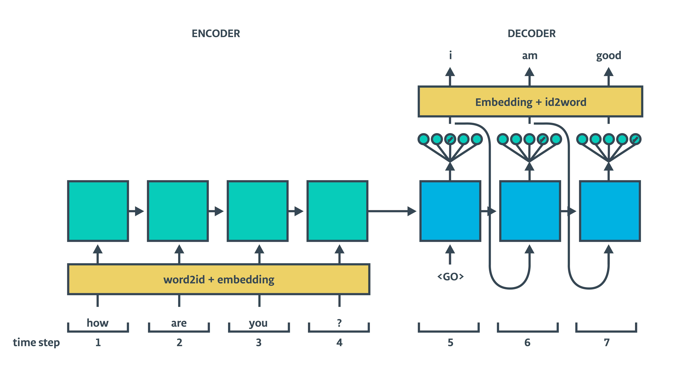

我们将编码器隐藏状态传递给训练和推理解码器，并将其处理其输出。 TensorFlow为我们处理大部分逻辑。我们只需要使用tf.contrib.seq2seq中的相应方法，并为它们提供适当的输入。

## 2.3 Seq2seq模型
现在我们来上面一步，使用我们刚刚宣布的方法连接编码器和解码器

模型输出* training_decoder_output *和* inference_decoder_output *都包含一个'rnn_output'logits张量，如下所示：

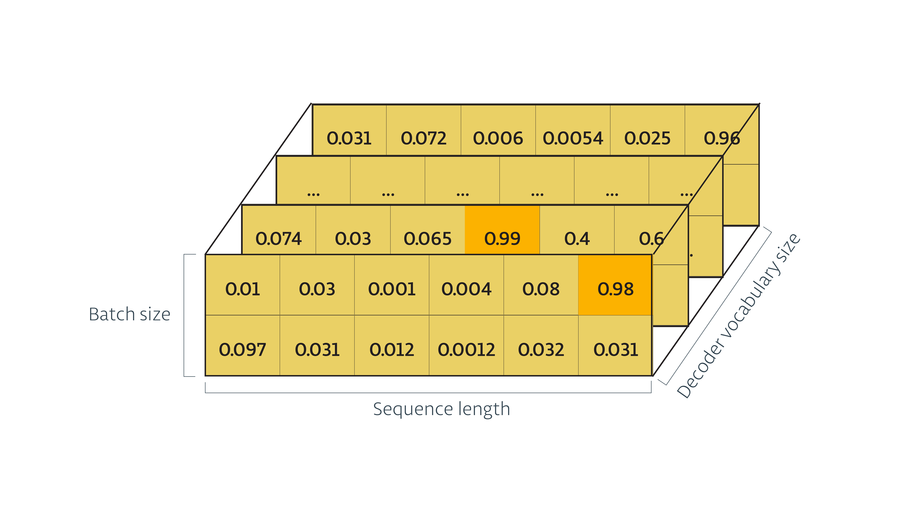

我们从训练张量得到的逻辑，我们将传递给tf.contrib.seq2seq ** sequence_loss（）**来计算损失，最终计算梯度。

 
## 批次

当我们检索批次时，处理量很小。 这是一个简单的例子，假设batch_size = 2

源序列（实际上是int形式，为了清楚起见我们正在显示字符）：

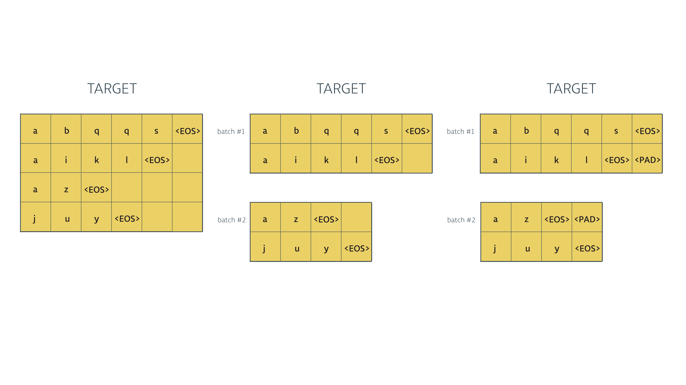

目标序列（也在int中，但为了清楚而显示字母）：

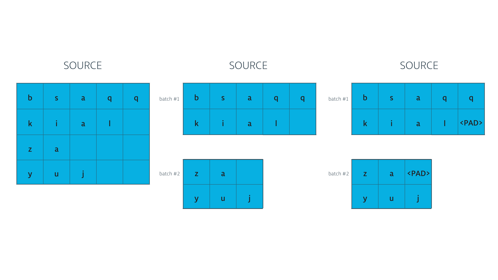

